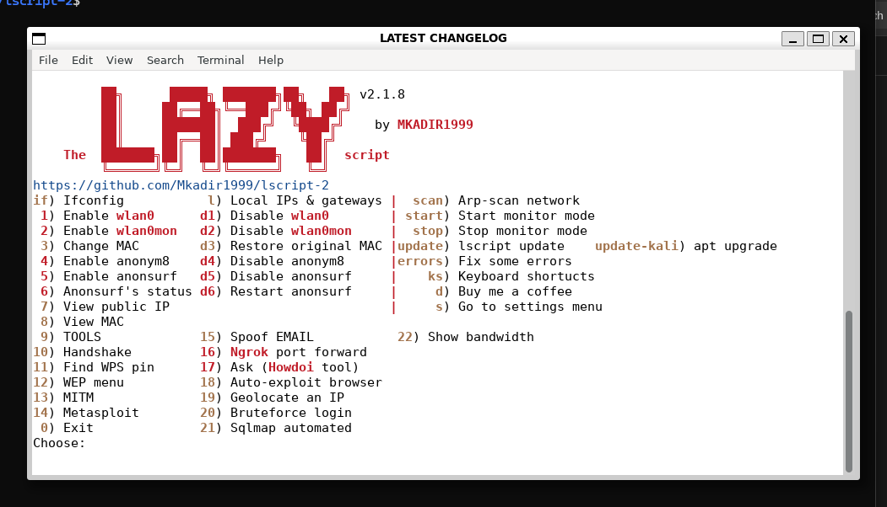

## Welcome to the LAZY script  v2.2.2

> **Launch with `lazy`** (recommended). On Ubuntu/Kali, `l` is often an alias for `ls` — use `lazy` or `command l`. See **[FEATURES.md](FEATURES.md)**.

### About

**LAZY script (lscript)** — maintained and improved by **KDR**.  
Repository: **[Mkadir1999/lscript-2](https://github.com/Mkadir1999/lscript-2)**

### Disclaimer — training & educational use only

**This tool is intended for authorized security training, education, and lab use only.**

- Use only on systems and networks you **own** or have **explicit written permission** to test.
- **Unauthorized access to computer systems is illegal** in most jurisdictions.
- **KDR** accepts **no responsibility or liability** for any misuse, damage, or legal consequences arising from use of this software.
- **You alone** are responsible for how you use this tool. By installing or running it, you agree to use it lawfully and at your own risk.

Full text: **[DISCLAIMER.md](DISCLAIMER.md)**

<p align="center">

</p>

**For feature recommendations, add them on the "Issues" tab.**

**TRAINING / EDUCATIONAL USE ONLY. KDR is not responsible for misuse. You use this tool at your own risk and must comply with all applicable laws.**

**This script will make your life easier, and of course faster.**

**Its not only for noobs.Its for whoever wants to type less and do actually more.**

### What is this
This is a script for Kali Linux that automates many procedures about wifi penetration and hacking.
I actually made it for fun for me just to save some time, but i don't mind publicing it.

### Features

   ### NEW: Operations toolkit (v2.1.7)
	
`doctor` / `health` — full dependency and path health-check with auto-fix
`refresh` / `toolsup` — git-pull all installed tools under /root
`profiles` / `psave` / `pload` — save WiFi targets; skip re-scanning
`pexport` / `pimport` — backup/restore settings, profiles, keyboard shortcuts
`rotate` — trim logs and old handshake files
`update-kali` — full Kali OS upgrade (apt full-upgrade); shell alias added on install
`settings/lscript.conf` — customize paths, colors, MAC, log limits
`install.sh --yes` — non-interactive install for scripts/CI
WSL2 detection — warns when wireless tools cannot work

   ### NEW FEATURE: Custom keyboard shortcuts!! Launch any tool within lscript , with your own shortcuts!!! (type ks to set your shortcuts)
	
Enabling-Disabling interfaces faster
Changing Mac faster
Anonymizing yourself faster
View your public IP faster
View your MAC faster
	
**TOOLS**

	You can install whichever tool(s) you want from within lscript! 
	Fluxion                         by Deltaxflux
	WifiTe                          by derv82
	Wifiphisher                     by George Chatzisofroniou
	Zatacker                        by LawrenceThePentester
	Morpheus                        by Pedro ubuntu  [ r00t-3xp10it ]
	Osrframework                    by i3visio
	Hakku                           by 4shadoww
	Trity                           by Toxic-ig
	Cupp                            by Muris Kurgas
	Dracnmap                        by Edo -maland-
	Fern Wifi Cracker               by Savio-code
	Kichthemout                     by Nikolaos Kamarinakis & David Schütz
	BeeLogger                       by Alisson Moretto - 4w4k3
	Ghost-Phisher                   by Savio-code
	Mdk3-master                     by Musket Developer
	Anonsurf                        by Und3rf10w
	The Eye                         by EgeBalci
	Airgeddon                       by v1s1t0r1sh3r3
	Xerxes                          by zanyarjamal
	Ezsploit                        by rand0m1ze
	Katana framework                by PowerScript
	4nonimizer                      by Hackplayers
	Sslstrip2                       by LeonardoNve
	Dns2proxy                       by LeonardoNve
	Pupy                            by n1nj4sec
	Zirikatu                        by pasahitz
	TheFatRat                       by Sceetsec
	Angry IP Scanner                by Anton Keks
	Sniper                          by 1N3
	ReconDog                        by UltimateHackers
	RED HAWK                        by Tuhinshubhra
	Routersploit                    by Reverse shell
	CHAOS                           by Tiagorlampert
	Winpayloads                     by Ncc group 
	Infoga                          by m4ll0k
	nWatch                          by Suraj
	Eternal scanner                 by Peterpt
	Eaphammer                       by S0lst1c3
	Dagon                           by Ekultek
	LALIN                           by Screetsec
	Ngrok                           by inconshreveable + more
	Kwetza                          by Chris Le Roy
	Bleachbit                       by Andrew Ziem
	Operative framework             by Tristan Granier
	Netattack2                      by Christian Klein
	Findsploit                      by 1N3
	Howdoi                          by Benjamin Gleitzman
	Dr0p1t-Framework                by Karim Shoair
	FakeImageExploiter              by r00t-3xp10it
	Leviathan                       by Utku Sen, Ozge Barbaros
	WiFi-Pumpkin                    by P0cL4bs
	Avet                            by govolution
	Meterpreter_Paranoid_Mode-SSL   by r00t-3xp10it
	Koadic                          by zerosum0x0
	Empire                          by Will Schroeder,
                                           Justin Warner, 
                                           Matt Nelson,
                                           Steve Borosh,
                                           Alex Rymdeko-harvey, 
                                           Chris Ross
	Veil                            by ChrisTruncer
	SecHub                          by JoshDelta
	DKMC                            by Mr.Un1k0d3r RingZer0 Team
	Demiguise                       by Richard Warren
	UniByAv                         by Mr.Un1k0d3r RingZer0 Team
	LFISuite                        by D35m0nd142
	Faraday                         by Infobyte
	MSFPC                           by g0tmi1k
	NoSQLMap                        by codingo, tcsstool
	Evil-Droid                      by Mascerano Bachir
	Iftop                           by Paul Warren, Chris Lightfoot
	MORE ARE BEING ADDED ON EVERY UPDATE
	
**Wifi password scripts**

	Handshake       (WPA-WPA2)
	Find WPS pin    (WPA-WPA2)
	WEP hacking     (WEP)    
	
**Others**

	Email spoofing (via `spoof` / menu 15)
	Metasploit automation (create payloads,listeners,save listeners for later etc...)
	Auto eternalblue exploiting (check on ks) -> hidden shortcuts
	Browser auto-expoiting with BeEF and MITMf
	SQLmap automated
	+more
		
# How to install (Kali Linux)

**MADE FOR KALI LINUX** (native install with a real WiFi adapter). Ubuntu on WSL is supported for the menu and many tools, but **not for wireless attacks** — see [Troubleshooting](#troubleshooting) below.

**Be careful:** if you download as a `.zip`, it will not run. Clone with `git` and run `install.sh`.

```bash
cd
apt-get update
git clone https://github.com/Mkadir1999/lscript-2.git
cd lscript-2
chmod +x install.sh
sudo ./install.sh
```

**Non-interactive (CI / automation):**

```bash
sudo ./install.sh --yes
```

The installer copies files to `/root/lscript`, adds `/usr/local/bin/lscript` to **root’s** PATH, and sets **`lazy`** (and `l`) launcher aliases in root’s `~/.bashrc`.

**Health check:** run `lazy` as root, then type `doctor` or `labcheck`.

**Configuration:** edit `/root/lscript/settings/lscript.conf` after install (paths, colors, MAC, log limits).

See **[FEATURES.md](FEATURES.md)** for commands, directory layout, and platform notes.

### How to run it

lscript must run as **root** (WiFi, MITM, and most tools need root).

```bash
sudo -i          # become root
source ~/.bashrc # load PATH + lazy alias (first time)
lazy             # launch the menu (recommended)
```

`l` still works if the installer alias is loaded (`unalias l` fixes the common `l` = `ls` conflict).

**One-liner without staying root:**

```bash
sudo /usr/local/bin/lscript/lazy
```

**The LAZY script — type `lazy` and go.**

### Troubleshooting

#### `l` only lists files (shows Changelog, README, l, lh1…)

On **Ubuntu** and some other distros, `l` is an **alias for `ls`**. Use **`lazy`** instead:

```bash
sudo -i
source ~/.bashrc
lazy
```

If `lazy` is not found, reinstall or run:

```bash
sudo /usr/local/bin/lscript/lazy
```

**Fresh install** (from your clone folder):

```bash
cd ~/lscript-2
chmod +x install.sh
sudo ./install.sh --yes
sudo -i
l
```

#### Installed but command not found

```bash
sudo -i
export PATH=/usr/local/bin/lscript:$PATH
l
```

Check the binary exists:

```bash
ls -la /usr/local/bin/lscript/l
ls -la /root/lscript/l
```

#### Ubuntu on Windows (WSL / WSL2)

| Works | Does not work |
|--------|----------------|
| Menu, install, `doctor`, `labcheck`, many CLI tools | Real WiFi monitor mode, handshake capture, WPS/WEP over wireless |
| `spoof` / MITM labs on a **wired** lab network | USB WiFi passthrough (hard to set up; often unreliable) |

- Install from your clone: `cd ~/lscript-2 && sudo ./install.sh --yes`
- Always launch as root: `sudo -i` then `l`
- lscript will show a **WSL warning** on startup — expected
- For full WiFi labs, use **native Kali** on bare metal or a VM with USB WiFi passthrough

#### `syntax error near unexpected token` (often line 9836 or `do\r`)

Scripts were saved with **Windows CRLF** line endings. Bash on Linux cannot parse `\r` and fails with errors like:

```
syntax error near unexpected token `('
syntax error near unexpected token `$'do\r''
```

**Quick fix (run as root):**

```bash
sed -i 's/\r$//' /root/lscript/l /usr/local/bin/lscript/l
sed -i 's/\r$//' /root/lscript/lib/*.sh /root/lscript/labs/*.sh /root/lscript/lh* /root/lscript/ls/*.sh
command l
```

**Or reinstall from a fresh clone** (install.sh now strips CRLF automatically):

```bash
cd ~/lscript-2
git pull
sudo ./install.sh --yes
sudo -i
command l
```

#### Still stuck?

Run these as your normal user and paste the output in a GitHub issue:

```bash
which l
type l
ls -la /usr/local/bin/lscript/l
sudo /usr/local/bin/lscript/l
```

### How to uninstall
``` 
cd /root/lscript
./uninstall.sh
rmdir -r /root/lscript 
```

### How to update
``` 
Run the script
Type "update"
```
